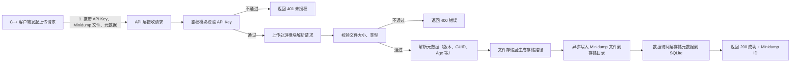
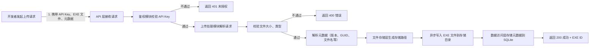
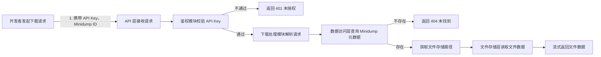
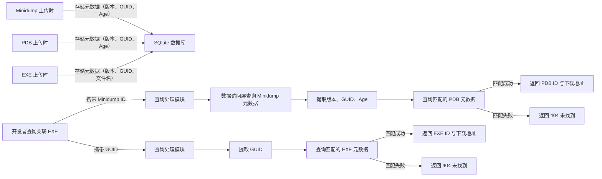

# Crash Handler Server 分层文档集

## 项目简介

Crash Handler Server 是基于 Rust 开发的轻量级崩溃信息收集服务器，核心功能为接收 C++ 客户端崩溃时生成的 Minidump 文件及对应 PDB 符号文件，通过 SQLite 数据库管理元数据，建立 Minidump 与 PDB 的精准关联，为开发者提供文件下载接口，支持使用 WinDbg 手动调试崩溃问题。

## 核心特性

- 可靠接收：支持 Minidump 与 PDB 文件的 HTTP 上传，含完整的参数校验与权限控制

- 精准关联：基于 EXE 版本号、GUID、Age 三元组建立文件关联，确保调试匹配准确性

- 高效查询：使用 SQLite 管理元数据，支持多维度筛选查询（版本、时间、GUID 等）

- 轻量部署：嵌入式 SQLite 数据库，无需独立部署依赖，支持 Docker 一键部署

- 安全可控：通过 API Key 鉴权，支持文件大小与类型限制，防止非法访问与恶意上传

## 环境要求

- 操作系统：Windows/Linux/macOS

- Rust 版本：1.70+（编译部署用）

- 运行依赖：无（SQLite 嵌入式，可执行文件独立运行）

- 网络要求：客户端与服务器网络互通，开放指定服务端口（默认 3000）

## 快速开始

### 1. 编译部署

```bash

git clone https://github.com/caomengxuan666/CFP.git
cd src/app/crash-server
# 编译 Release 版本
cargo build --release

# 创建必要目录
mkdir -p data storage/minidumps storage/pdbs storage/exes config logs
```

### 2. 配置文件

在 config 目录下创建 config.toml，配置内容如下：

```toml

[server]
port = 3000          # 服务端口
host = "0.0.0.0"     # 监听地址，0.0.0.0 支持外网访问
api_key = "your-secret-api-key"  # 替换为实际的 API Key，用于接口鉴权

[storage]
base_path = "./storage"          # 文件存储根目录
max_minidump_size = 104857600    # Minidump 最大大小（100MB）
max_pdb_size = 524288000         # PDB 最大大小（500MB）
max_exe_size = 524288000         # EXE 最大大小（500MB）

[database]
path = "./data/crash_handler.db" # SQLite 数据库文件路径

[logging]
level = "info"                   # 日志级别：trace/debug/info/warn/error
file = "./logs/server.log"       # 日志文件路径
```

### 3. 启动服务

```bash

# Linux/macOS
./target/release/crash_handler_server

# Windows
./target/release/crash_handler_server.exe
```

### 4. Docker 快速部署

```bash

# 构建 Docker 镜像
docker build -t crash-handler-server .

# 运行容器（挂载数据目录，确保数据持久化）
docker run -d -p 3000:3000 \
  -v $(pwd)/data:/app/data \
  -v $(pwd)/storage:/app/storage \
  -v $(pwd)/logs:/app/logs \
  --name crash-handler \
  crash-handler-server
```

## 核心功能使用

- Minidump 上传：客户端崩溃时上传 Minidump 文件及元数据

- PDB 上传：开发者/CI/CD 上传与 EXE 匹配的 PDB 文件

- EXE 上传：开发者上传原始 EXE 文件，便于调试

- 文件下载：开发者下载 Minidump 与匹配的 PDB/EXE 文件用于调试

- 查询筛选：按版本、时间、GUID 等条件查询崩溃记录

- PDB 匹配查询：根据 Minidump 的 EXE 版本、GUID 和 Age 值查找匹配的 PDB 文件

- EXE 查询：根据 GUID 查找对应的 EXE 文件信息

## 调试流程

1. 通过查询接口获取目标崩溃的 Minidump ID

2. 下载 Minidump 文件

3. 查询该 Minidump 关联的 PDB 和 EXE 信息并下载对应文件

4. 使用 WinDbg 加载 Minidump 与 PDB 文件进行调试

## 维护与支持

- 日志查看：通过 logs/server.log 查看服务运行状态与异常信息

- 数据库备份：定期备份 data/crash_handler.db 文件

- 存储清理：定期归档/删除过期 Minidump 文件，释放磁盘空间

- 常见问题：参考《实现细节/API》文档的「常见问题处理」章节

## 1. 技术选型

|技术领域|选型|选型理由|
|---|---|---|
|Web 框架|Axum|基于 Tokio 异步运行时，性能高效，API 设计简洁，易于上手，适合构建轻量级服务|
|数据库|SQLite + rusqlite|嵌入式数据库，无需独立部署，轻量高效；rusqlite 是 Rust 生态成熟的 SQLite 绑定，支持异步操作|
|序列化/反序列化|Serde + serde_json|Rust 生态标准序列化库，支持 JSON 等多种格式，性能优异，适配元数据传输需求|
|文件操作|Tokio FS|Tokio 提供的异步文件系统 API，避免文件操作阻塞服务主线程，提升并发处理能力|
|身份认证|API Key 鉴权|实现简单，部署成本低，可满足内部服务的权限控制需求，后续可扩展为 OAuth2|
|日志处理|log + env_logger|轻量级日志库，配置简单，支持多级别日志输出，可满足服务运行状态监控需求|
|部署方式|Docker|容器化部署，环境隔离，可一键打包运行依赖，简化跨环境部署流程|

## 2. 开发阶段划分与任务拆解

|开发阶段|核心任务|交付物|时间预估|
|---|---|---|---|
|阶段 1：项目初始化与基础配置|1. 创建 Rust 项目，添加核心依赖；2. 设计并编写配置文件解析逻辑；3. 搭建基础日志框架|初始化项目结构、配置解析模块、日志模块|1 天|
|阶段 2：数据库层开发|1. 设计 SQLite 表结构与索引；2. 封装数据库连接池；3. 实现 Minidump/PDB 元数据的 CRUD 操作|数据库初始化脚本、数据访问层代码|2 天|
|阶段 3：文件存储层开发|1. 设计文件存储目录结构；2. 实现文件路径生成逻辑；3. 开发异步文件读写、大小/类型校验功能|文件存储模块代码、文件校验工具函数|2 天|
|阶段 4：API 接口开发|1. 配置 Axum 路由；2. 实现 Minidump/PDB 上传接口；3. 实现文件下载接口；4. 实现多条件查询接口；5. 开发 API Key 鉴权中间件|完整 API 接口代码、鉴权中间件|3 天|
|阶段 5：增加EXE功能|1. 扩展数据库结构，添加EXE元数据表；2. 实现EXE文件上传/下载接口；3. 添加EXE查询功能；4. 更新相关文档|EXE功能代码、更新后的文档|1 天|
|阶段 6：异常处理与测试|1. 完善全局异常处理逻辑；2. 编写单元测试（数据层、文件层）；3. 进行接口测试与压力测试；4. 修复测试中发现的问题|测试用例、测试报告、优化后的代码|2 天|
|阶段 7：部署文档与使用文档编写|1. 编写 Dockerfile 与部署脚本；2. 撰写 README、技术路线、系统架构、实现细节/API 文档；3. 整理客户端集成示例代码|Dockerfile、部署脚本、完整文档集、客户端集成示例|1 天|

## 3. 核心开发步骤

### 3.1 项目初始化

```bash

# 创建项目
cargo new crash_handler_server
cd crash_handler_server

# 添加核心依赖
cargo add axum tokio --features full
cargo add serde --features derive
cargo add serde_json
cargo add rusqlite --features bundled
cargo add uuid --features v4,serde
cargo add tower-http --features multipart
cargo add chrono --features serde
cargo add config
cargo add log env_logger
```

### 3.2 数据库层核心实现

1. 编写数据库初始化脚本，创建 minidumps、pdbs、exes 表及索引

2. 封装数据库连接池，确保并发安全访问

3. 实现元数据的新增、查询、删除等操作，暴露统一的数据访问接口

### 3.3 文件存储层核心实现

1. 基于 EXE 版本号、GUID、Age 设计分层存储目录

2. 实现文件路径生成函数，确保文件名唯一（结合时间戳、PID、TID）

3. 开发异步文件写入/读取函数，配合 Tokio 实现非阻塞操作

4. 添加文件大小校验、类型校验（检查文件头）逻辑，防止非法文件上传

### 3.4 API 层核心实现

1. 配置 Axum 路由，划分上传、下载、查询等接口路径

2. 实现 multipart 表单解析，处理文件上传与元数据接收

3. 开发文件下载接口，支持流式传输文件

4. 实现多条件查询逻辑，支持分页、版本筛选、时间范围筛选等

5. 编写 API Key 鉴权中间件，拦截未授权请求

### 3.5 安全与异常处理

1. 对所有输入参数进行严格校验，防止非法数据注入

2. 处理文件读写失败、数据库操作异常、网络请求异常等场景

3. 记录详细的操作日志与异常日志，便于问题排查

## 4. 关键技术点说明

- 异步编程：基于 Tokio 运行时，实现 HTTP 请求处理、文件操作、数据库访问的全异步，提升服务并发能力

- 数据库连接池：避免频繁创建/关闭数据库连接，提升数据库访问效率

- 路径安全：严格校验文件路径，防止路径遍历攻击，确保文件存储在指定目录内

- 元数据关联：通过 EXE 版本号 + GUID + Age 三元组实现 Minidump 与 PDB/EXE 的精准匹配，确保调试准确性

## 5. 交付标准

- 功能完整：所有核心接口（上传、下载、查询）正常可用，符合接口规范

- 性能达标：支持 10 并发上传（100MB 文件）无超时，查询响应时间 < 100ms

- 稳定可靠：连续运行 72 小时无崩溃，文件上传/下载无丢失

- 文档齐全：提供完整的分层文档，包含部署、使用、开发相关说明

## 1. 架构概述

Crash Handler Server 采用分层架构设计，从上至下分为 API 层、业务逻辑层、数据访问层、文件存储层，各层职责清晰、解耦良好，便于开发维护与后续扩展。系统核心目标是可靠接收、存储 Minidump 与 PDB 文件，建立精准关联，提供高效的查询与下载能力，不涉及自动崩溃分析，将调试工作交还给开发者。

## 2. 整体架构图

```

flowchart TD
    %% 外部角色
    A[C++ 客户端] -->|POST Minidump + 元数据| B[Rust 服务器]
    C[CI/CD 系统/开发者] -->|POST PDB + 元数据| B
    D[开发者] -->|POST EXE + 元数据| B
    E[开发者] -->|GET 查询/下载| B
    E -->|WinDbg 调试| F[本地文件（Minidump+PDB+EXE）]
    
    %% 服务器内部分层
    B --> G[API 层 - Axum]
    G --> H[业务逻辑层]
    H --> I[数据访问层]
    H --> J[文件存储层]
    
    %% 数据存储
    I --> K[SQLite 数据库]
    J --> L[Minidump 存储目录]
    J --> M[PDB 存储目录]
    J --> N[EXE 存储目录]
    K --> O[元数据管理（Minidump/PDB/EXE 关联信息）]
    
    %% 辅助模块
    H --> P[鉴权模块（API Key 验证）]
    H --> Q[日志模块]
    H --> R[配置模块]
```

## 3. 核心模块职责

|模块层级|核心模块|具体职责|
|---|---|---|
|API 层|Axum 路由模块|1. 接收外部 HTTP 请求（上传、下载、查询）；2. 解析请求参数与请求体；3. 调用业务逻辑层接口；4. 封装响应结果并返回|
|业务逻辑层|上传处理模块|1. 校验上传文件的大小、类型；2. 解析上传的元数据；3. 调用文件存储层保存文件；4. 调用数据访问层存储元数据|
||下载处理模块|1. 校验请求的文件 ID 合法性；2. 调用数据访问层查询文件存储路径；3. 调用文件存储层读取文件；4. 流式返回文件数据|
||查询处理模块|1. 解析查询参数（版本、时间、GUID 等）；2. 调用数据访问层执行查询；3. 处理分页逻辑；4. 封装查询结果|
||鉴权模块|1. 拦截所有外部请求；2. 校验请求头中的 API Key；3. 拒绝未授权请求并返回错误信息|
|数据访问层|SQLite 操作模块|1. 管理数据库连接池；2. 执行 Minidump/PDB/EXE 元数据的 CRUD 操作；3. 实现多条件查询与索引优化；4. 处理数据库异常|
|文件存储层|文件操作模块|1. 管理文件存储目录；2. 生成唯一的文件存储路径；3. 实现异步文件读写；4. 校验文件完整性|
|辅助模块|日志模块|1. 记录服务运行日志（请求日志、操作日志）；2. 记录异常日志（错误信息、堆栈跟踪）；3. 按级别输出日志到文件|
||配置模块|1. 加载并解析配置文件；2. 提供全局配置访问接口；3. 支持配置参数动态校验|

## 4. 核心业务流程

### 4.1 Minidump 上传流程



### 4.2 PDB 上传流程


### 4.3 EXE 上传流程



### 4.4 Minidump 下载流程



### 4.5 Minidump、PDB 与 EXE 关联流程



## 5. 数据存储架构

### 5.1 目录结构设计

采用分层目录结构，基于 EXE 版本号、GUID、Age 划分，确保 Minidump 与 PDB/EXE 天然关联，便于查找与管理：

```text

./
├── data/                    # 数据库目录
│   └── crash_handler.db     # SQLite 数据库文件（存储元数据）
├── storage/                 # 文件存储根目录
│   ├── minidumps/           # Minidump 文件存储目录
│   │   └── {exe_version}/   # 按 EXE 版本号分层
│   │       └── {exe_guid}_{exe_age}/  # 按 GUID+Age 分层
│   │           └── crash_{timestamp}_{pid}_{tid}.dmp  # 唯一文件名
│   ├── pdbs/                # PDB 文件存储目录
│   │   └── {exe_version}/   # 按 EXE 版本号分层
│   │       └── {exe_guid}_{exe_age}/  # 按 GUID+Age 分层
│   │           └── {pdb_filename}.pdb  # PDB 文件名
│   └── exes/                # EXE 文件存储目录
│       └── {exe_version}/   # 按 EXE 版本号分层
│           └── {exe_guid}/  # 按 GUID 分层
│               └── {exe_filename}.exe  # EXE 文件名
├── config/                  # 配置目录
│   └── config.toml          # 服务配置文件
└── logs/                    # 日志目录
    └── server.log           # 服务运行日志
    
```

### 5.2 数据库表结构设计

核心表为 minidumps 表、pdbs 表和exes表，通过版本号 + GUID + Age 建立关联，同时设计索引提升查询效率：

- minidumps 表：存储 Minidump 元数据（ID、时间戳、版本、GUID、Age、PID、TID、异常信息、文件路径等）

- pdbs 表：存储 PDB 元数据（ID、版本、GUID、Age、文件名、文件路径、上传时间等）

- exes 表：存储 EXE 元数据（ID、版本、GUID、文件名、文件路径、上传时间等）

- 索引：为版本号、GUID+Age、时间戳等字段建立索引，优化查询性能

## 6. 扩展性设计

架构设计预留扩展空间，支持后续按需扩展：

- 存储扩展：文件存储层支持替换为 S3/MinIO 等对象存储，适应大规模部署

- 数据库扩展：数据访问层支持替换为 PostgreSQL，支持多节点共享数据，实现分布式部署

- 功能扩展：业务逻辑层预留接口，可新增告警模块、Web 管理界面模块等

- 鉴权扩展：鉴权模块支持扩展为 OAuth2 鉴权，适配更复杂的权限管理需求

## 1. 数据库实现细节

### 1.1 表结构定义

#### 1.1.1 minidumps 表（Minidump 元数据表）

```sql

CREATE TABLE IF NOT EXISTS minidumps (
    id TEXT PRIMARY KEY,                  -- UUID，Minidump 唯一标识
    timestamp TEXT NOT NULL,              -- 崩溃时间（ISO8601 格式，如 2026-01-06T12:34:56Z）
    exe_version TEXT NOT NULL,            -- EXE 版本号（如 1.0.2.3）
    exe_guid TEXT NOT NULL,               -- EXE 的 GUID（与 PDB 匹配的核心字段）
    exe_age INTEGER NOT NULL,             -- PDB 的 Age 值（与 GUID 配合匹配）
    pid INTEGER NOT NULL,                 -- 崩溃进程 ID
    tid INTEGER NOT NULL,                 -- 崩溃线程 ID
    exception_code TEXT NOT NULL,         -- 异常代码（如 0xC0000005）
    exception_address TEXT,               -- 异常地址（十六进制，如 0x00007FF6A0001000）
    file_path TEXT NOT NULL,              -- Minidump 文件存储路径
    created_at TEXT NOT NULL              -- 服务器接收时间（ISO8601 格式）
);
```

#### 1.1.2 pdbs 表（PDB 元数据表）

```sql

CREATE TABLE IF NOT EXISTS pdbs (
    id TEXT PRIMARY KEY,                  -- UUID，PDB 唯一标识
    exe_version TEXT NOT NULL,            -- EXE 版本号
    exe_guid TEXT NOT NULL,               -- EXE 的 GUID（与 Minidump 匹配的核心字段）
    exe_age INTEGER NOT NULL,             -- PDB 的 Age 值（与 GUID 配合匹配）
    pdb_filename TEXT NOT NULL,           -- PDB 文件名（如 MyApp.pdb）
    file_path TEXT NOT NULL,              -- PDB 文件存储路径
    uploaded_at TEXT NOT NULL             -- 上传时间（ISO8601 格式）
);
```

#### 1.1.3 exes 表（EXE 元数据表）

```sql

CREATE TABLE IF NOT EXISTS exes (
    id TEXT PRIMARY KEY,                  -- UUID，EXE 唯一标识
    exe_version TEXT NOT NULL,            -- EXE 版本号
    exe_guid TEXT NOT NULL,               -- EXE 的 GUID（与 Minidump/PDB 匹配的核心字段）
    exe_filename TEXT NOT NULL,           -- EXE 文件名（如 MyApp.exe）
    file_path TEXT NOT NULL,              -- EXE 文件存储路径
    uploaded_at TEXT NOT NULL             -- 上传时间（ISO8601 格式）
);
```

### 1.2 索引设计

```sql

-- Minidump 查询索引：优化版本筛选、GUID+Age 匹配、时间范围查询
CREATE INDEX IF NOT EXISTS idx_minidumps_version ON minidumps(exe_version);
CREATE INDEX IF NOT EXISTS idx_minidumps_guid_age ON minidumps(exe_guid, exe_age);
CREATE INDEX IF NOT EXISTS idx_minidumps_timestamp ON minidumps(timestamp);

-- PDB 查询索引：优化版本筛选、GUID+Age 匹配
CREATE INDEX IF NOT EXISTS idx_pdbs_guid_age ON pdbs(exe_guid, exe_age);
CREATE INDEX IF NOT EXISTS idx_pdbs_version ON pdbs(exe_version);

-- EXE 查询索引：优化版本筛选、GUID 匹配
CREATE INDEX IF NOT EXISTS idx_exes_guid ON exes(exe_guid);
CREATE INDEX IF NOT EXISTS idx_exes_version ON exes(exe_version);
```

### 1.3 数据库初始化流程

1. 服务启动时，检查 data 目录是否存在，不存在则创建

2. 检查 crash_handler.db 文件是否存在，不存在则创建

3. 执行初始化 SQL 脚本，创建 minidumps 表、pdbs 表、exes 表及索引

4. 初始化数据库连接池，设置最大连接数（默认 10）

## 2. 文件存储实现细节

### 2.1 文件路径生成规则

#### 2.1.1 Minidump 文件路径

```text

./storage/minidumps/{exe_version}/{exe_guid}_{exe_age}/crash_{timestamp}_{pid}_{tid}.dmp
```

参数说明：

- {exe_version}：EXE 版本号（如 1.0.2.3）

- {exe_guid}：EXE 的 GUID（如 12345678-1234-1234-1234-1234567890AB）

- {exe_age}：PDB 的 Age 值（整数，如 1）

- {timestamp}：崩溃时间戳（格式：YYYYMMDDHHMMSS，如 20260106123456）

- {pid}：崩溃进程 ID（如 1234）

- {tid}：崩溃线程 ID（如 5678）

#### 2.1.2 PDB 文件路径

```text

./storage/pdbs/{exe_version}/{exe_guid}_{exe_age}/{pdb_filename}.pdb
```

参数说明：

- {pdb_filename}：PDB 原始文件名（如 MyApp.pdb）

- 其他参数同 Minidump 文件路径

#### 2.1.3 EXE 文件路径

```text

./storage/exes/{exe_version}/{exe_guid}/{exe_filename}.exe
```

参数说明：

- {exe_filename}：EXE 原始文件名（如 MyApp.exe）

- 其他参数同 Minidump 文件路径

### 2.2 文件校验规则

#### 2.2.1 大小校验

- Minidump 文件：最大 100MB（可通过配置文件修改）

- PDB 文件：最大 500MB（可通过配置文件修改）

- EXE 文件：最大 500MB（可通过配置文件修改）

#### 2.2.2 类型校验

通过检查文件头判断文件类型，防止非法文件上传：

- Minidump 文件头：0x4D444D50（ASCII：MDMP）

- PDB 文件头：0x53504442（ASCII：SPDB）

- EXE 文件头：0x4D5A（ASCII：MZ）

### 2.3 异步文件操作实现

基于 Tokio FS 实现异步文件读写，避免阻塞服务主线程：

- 文件写入：接收上传文件流后，异步写入指定目录，写入完成后再更新数据库元数据

- 文件读取：下载时异步读取文件数据，通过 Axum 流式返回给客户端，减少内存占用

## 3. API 接口规范

### 3.1 通用规范

- 基础 URL：http://<server-ip>:<port>/api（port 默认为 3000）

- 请求头：所有接口需携带 X-API-Key 头，值为配置文件中设定的 API Key

- 请求/响应格式：除文件上传/下载接口外，其余接口均使用 JSON 格式

- 响应码规范：

  - 200：成功

  - 400：请求参数错误/文件校验失败

  - 401：未授权（API Key 错误/缺失）

  - 404：资源未找到（文件不存在/ID 错误）

  - 500：服务器内部错误

- 统一响应格式：
       `{
  "success": true/false,  // 接口调用是否成功
  "data": {},             // 成功时返回的数据（可选）
  "error": ""             // 失败时返回的错误信息（可选）
}`

### 3.2 具体接口定义

#### 3.2.1 上传 Minidump

- URL：/upload/minidump

- 方法：POST

- 请求头：

  - Content-Type: multipart/form-data

  - X-API-Key: <your-api-key>

- 请求体（multipart/form-data 字段）：

  - metadata：JSON 格式的 Minidump 元数据（text 类型）

  - minidump：Minidump 文件（file 类型，.dmp 后缀）

- metadata 示例：
        `{
  "timestamp": "2026-01-06T12:34:56Z",
  "exe_version": "1.0.2.3",
  "exe_guid": "12345678-1234-1234-1234-1234567890AB",
  "exe_age": 1,
  "pid": 1234,
  "tid": 5678,
  "exception_code": "0xC0000005",
  "exception_address": "0x00007FF6A0001000"
}`

- 成功响应（200）：
        `{
  "success": true,
  "data": {
    "minidump_id": "550e8400-e29b-41d4-a716-446655440000",
    "file_path": "./storage/minidumps/1.0.2.3/12345678-1234-1234-1234-1234567890AB_1/crash_20260106123456_1234_5678.dmp"
  }
}`

- 失败响应（400）：
        `{
  "success": false,
  "error": "文件上传失败：文件大小超过限制（最大 100MB）"
}`

#### 3.2.2 上传 PDB

- URL：/upload/pdb

- 方法：POST

- 请求头：

  - Content-Type: multipart/form-data

  - X-API-Key: <your-api-key>

- 请求体（multipart/form-data 字段）：

  - metadata：JSON 格式的 PDB 元数据（text 类型）

  - pdb：PDB 文件（file 类型，.pdb 后缀）

- metadata 示例：
       `{
  "exe_version": "1.0.2.3",
  "exe_guid": "12345678-1234-1234-1234-1234567890AB",
  "exe_age": 1,
  "pdb_filename": "MyApp.pdb"
}`

- 成功响应（200）：
        `{
  "success": true,
  "data": {
    "pdb_id": "550e8400-e29b-41d4-a716-446655440001",
    "file_path": "./storage/pdbs/1.0.2.3/12345678-1234-1234-1234-1234567890AB_1/MyApp.pdb"
  }
}`

- 失败响应（400）：
        `{
  "success": false,
  "error": "文件上传失败：文件类型错误（需上传 .pdb 文件）"
}`

#### 3.2.3 上传 EXE

- URL：/upload/exe

- 方法：POST

- 请求头：

  - Content-Type: multipart/form-data

  - X-API-Key: <your-api-key>

- 请求体（multipart/form-data 字段）：

  - metadata：JSON 格式的 EXE 元数据（text 类型）

  - exe：EXE 文件（file 类型，.exe 后缀）

- metadata 示例：
       `{
  "exe_version": "1.0.2.3",
  "exe_guid": "12345678-1234-1234-1234-1234567890AB",
  "exe_filename": "MyApp.exe"
}`

- 成功响应（200）：
        `{
  "success": true,
  "data": {
    "exe_id": "550e8400-e29b-41d4-a716-446655440002",
    "file_path": "./storage/exes/1.0.2.3/12345678-1234-1234-1234-1234567890AB/MyApp.exe"
  }
}`

- 失败响应（400）：
        `{
  "success": false,
  "error": "文件上传失败：文件类型错误（需上传 .exe 文件）"
}`

#### 3.2.4 下载 Minidump

- URL：/download/minidump/{minidump_id}

- 方法：GET

- 请求头：X-API-Key: <your-api-key>

- 路径参数：minidump_id - Minidump 唯一标识（上传时返回的 minidump_id）

- 成功响应（200）：

  - Content-Type: application/octet-stream

  - 响应体：Minidump 文件流

- 失败响应（404）：
        `{
  "success": false,
  "error": "Minidump 不存在（ID：550e8400-e29b-41d4-a716-446655440000）"
}`

#### 3.2.5 下载 PDB

- URL：/download/pdb/{pdb_id}

- 方法：GET

- 请求头：X-API-Key: <your-api-key>

- 路径参数：pdb_id - PDB 唯一标识（上传时返回的 pdb_id）

- 成功响应（200）：

  - Content-Type: application/octet-stream

  - 响应体：PDB 文件流

- 失败响应（404）：`{
  "success": false,
  "error": "PDB 不存在（ID：550e8400-e29b-41d4-a716-446655440001）"
}`

#### 3.2.6 下载 EXE

- URL：/download/exe/{exe_id}

- 方法：GET

- 请求头：X-API-Key: <your-api-key>

- 路径参数：exe_id - EXE 唯一标识（上传时返回的 exe_id）

- 成功响应（200）：

  - Content-Type: application/octet-stream

  - 响应体：EXE 文件流

- 失败响应（404）：`{
  "success": false,
  "error": "EXE 不存在（ID：550e8400-e29b-41d4-a716-446655440002）"
}`

#### 3.2.7 查询 Minidump 列表

- URL：/list/minidumps

- 方法：GET

- 请求头：X-API-Key: <your-api-key>

- 查询参数（均为可选）：

  - version：按 EXE 版本号筛选（如 1.0.2.3）

  - guid：按 EXE GUID 筛选（如 12345678-1234-1234-1234-1234567890AB）

  - start_time：按崩溃时间筛选（开始时间，ISO8601 格式）

  - end_time：按崩溃时间筛选（结束时间，ISO8601 格式）

  - page：页码（默认 1）

  - page_size：每页数量（默认 20，最大 100）

- 成功响应（200）：
        `{
  "success": true,
  "data": {
    "minidumps": [],
    "page": 1,
    "page_size": 20,
    "total": 0
  }
}`

#### 3.2.8 查找匹配的PDB

- URL：/find/matching-pdb

- 方法：GET

- 请求头：X-API-Key: <your-api-key>

- 查询参数（必需）：

  - exe_version：EXE 版本号（如 1.0.2.3）

  - exe_guid：EXE 的 GUID（如 12345678-1234-1234-1234-1234567890AB）

  - exe_age：PDB 的 Age 值（整数，如 1）

- 成功响应（200）：
        `{
  "success": true,
  "data": {
    "pdb": {
      "id": "550e8400-e29b-41d4-a716-446655440001",
      "exe_version": "1.0.2.3",
      "exe_guid": "12345678-1234-1234-1234-1234567890AB",
      "exe_age": 1,
      "pdb_filename": "MyApp.pdb",
      "file_path": "./storage/pdbs/1.0.2.3/12345678-1234-1234-1234-1234567890AB_1/MyApp.pdb",
      "uploaded_at": "2026-01-06T12:34:56Z"
    },
    "message": "Matching PDB found"
  }
}`

- 失败响应（404）：
        `{
  "success": false,
  "error": "No matching PDB found for the given parameters"
}`

#### 3.2.9 通过 GUID 查找 EXE

- URL：/find/exe-by-guid

- 方法：GET

- 请求头：X-API-Key: <your-api-key>

- 查询参数（必需）：

  - exe_guid：EXE 的 GUID（如 12345678-1234-1234-1234-1234567890AB）

- 成功响应（200）：
        `{
  "success": true,
  "data": {
    "exe": {
      "id": "550e8400-e29b-41d4-a716-446655440002",
      "exe_version": "1.0.2.3",
      "exe_guid": "12345678-1234-1234-1234-1234567890AB",
      "exe_filename": "MyApp.exe",
      "file_path": "./storage/exes/1.0.2.3/12345678-1234-1234-1234-1234567890AB/MyApp.exe",
      "uploaded_at": "2026-01-06T12:34:56Z"
    },
    "message": "Matching EXE found"
  }
}`

- 失败响应（404）：
        `{
  "success": false,
  "error": "No matching EXE found for the given GUID"
}`

## 4. 客户端集成示例

### 4.1 C++ Minidump 上传示例（使用 WinHTTP）

``cpp
#include <windows.h>
#include <winhttp.h>
#include <iostream>
#include <sstream>

// 上传 Minidump 文件到服务器
bool UploadMinidump(const std::wstring& dumpFilePath) {
    HINTERNET hSession = WinHttpOpen(L"MinidumpUploader/1.0", 
                                     WINHTTP_ACCESS_TYPE_DEFAULT_PROXY,
                                     WINHTTP_NO_PROXY_NAME, 
                                     WINHTTP_NO_PROXY_BYPASS, 0);
    
    if (!hSession) return false;
    
    HINTERNET hConnect = WinHttpConnect(hSession, L"your-server.com", 3000, 0);
    HINTERNET hRequest = WinHttpOpenRequest(hConnect, L"POST", L"/upload/minidump",
                                            NULL, WINHTTP_NO_REFERER,
                                            L"multipart/form-data",
                                            0);
    
    // 设置 API Key
    WinHttpAddRequestHeaders(hRequest, L"X-API-Key: your-secret-api-key",
                             -1, WINHTTP_ADDREQ_FLAG_ADD);
    
    // 读取 dump 文件内容
    HANDLE hFile = CreateFile(dumpFilePath.c_str(), GENERIC_READ, 0, NULL, OPEN_EXISTING, 0, NULL);
    if (hFile == INVALID_HANDLE_VALUE) return false;
    
    DWORD fileSize = GetFileSize(hFile, NULL);
    std::vector<BYTE> fileData(fileSize);
    DWORD bytesRead;
    ReadFile(hFile, fileData.data(), fileSize, &bytesRead, NULL);
    CloseHandle(hFile);
    
    // 构建 multipart 表单数据
    // ... multipart 构建代码 ...
    
    // 发送请求
    BOOL result = WinHttpSendRequest(hRequest, WINHTTP_NO_ADDITIONAL_HEADERS, 0,
                                     WINHTTP_NO_REQUEST_DATA, 0, 0, 0);
    if (result) {
        result = WinHttpReceiveResponse(hRequest, NULL);
    }
    
    WinHttpCloseHandle(hRequest);
    WinHttpCloseHandle(hConnect);
    WinHttpCloseHandle(hSession);
    
    return result != 0;
}
```

### 4.2 Python PDB 上传示例（用于 CI/CD）

``python
import requests
import json

def upload_pdb_to_server(pdb_path, exe_version, exe_guid, exe_age, pdb_filename, server_url, api_key):
    """
    上传 PDB 文件到服务器
    """
    url = f"{server_url}/upload/pdb"
    headers = {
        "X-API-Key": api_key
    }
    
    # PDB 元数据
    metadata = {
        "exe_version": exe_version,
        "exe_guid": exe_guid,
        "exe_age": exe_age,
        "pdb_filename": pdb_filename
    }
    
    with open(pdb_path, 'rb') as pdb_file:
        files = {
            'metadata': (None, json.dumps(metadata), 'application/json'),
            'pdb': (pdb_filename, pdb_file, 'application/octet-stream')
        }
        response = requests.post(url, files=files, headers=headers)
        return response.json()

# 使用示例
if __name__ == "__main__":
    result = upload_pdb_to_server(
        pdb_path="./output/MyApp.pdb",
        exe_version="1.0.2.3",
        exe_guid="12345678-1234-1234-1234-1234567890AB",
        exe_age=1,
        pdb_filename="MyApp.pdb",
        server_url="http://localhost:3000",
        api_key="your-secret-api-key"
    )
    print(result)
```

### 4.3 Python EXE 上传示例

``python
import requests
import json

def upload_exe_to_server(exe_path, exe_version, exe_guid, exe_filename, server_url, api_key):
    """
    上传 EXE 文件到服务器
    """
    url = f"{server_url}/upload/exe"
    headers = {
        "X-API-Key": api_key
    }
    
    # EXE 元数据
    metadata = {
        "exe_version": exe_version,
        "exe_guid": exe_guid,
        "exe_filename": exe_filename
    }
    
    with open(exe_path, 'rb') as exe_file:
        files = {
            'metadata': (None, json.dumps(metadata), 'application/json'),
            'exe': (exe_filename, exe_file, 'application/octet-stream')
        }
        response = requests.post(url, files=files, headers=headers)
        return response.json()

# 使用示例
if __name__ == "__main__":
    result = upload_exe_to_server(
        exe_path="./output/MyApp.exe",
        exe_version="1.0.2.3",
        exe_guid="12345678-1234-1234-1234-1234567890AB",
        exe_filename="MyApp.exe",
        server_url="http://localhost:3000",
        api_key="your-secret-api-key"
    )
    print(result)
```

## 5. 部署与运维

### 5.1 Docker 部署脚本

```
FROM rust:1.70 as builder

WORKDIR /app
COPY . .
RUN cargo build --release

FROM debian:bullseye-slim

RUN apt-get update && apt-get install -y \
    ca-certificates \
    && rm -rf /var/lib/apt/lists/*

WORKDIR /app

COPY --from=builder /app/target/release/crash_handler_server ./crash_handler_server
COPY config/config.toml ./config/config.toml

EXPOSE 3000

CMD ["./crash_handler_server"]
```

### 5.2 Docker Compose 部署

```
version: '3.8'

services:
  crash-server:
    build: .
    container_name: crash-handler
    ports:
      - "3000:3000"
    volumes:
      - ./data:/app/data
      - ./storage:/app/storage
      - ./logs:/app/logs
    restart: unless-stopped
```

### 5.3 系统监控脚本

```
#!/bin/bash

# 检查服务状态
check_service() {
    if curl -f -H "X-API-Key: your-api-key" http://localhost:3000/health > /dev/null 2>&1; then
        echo "✅ Service is running"
        return 0
    else
        echo "❌ Service is not responding"
        return 1
    fi
}

# 检查存储空间
check_storage() {
    local storage_path="./storage"
    local disk_usage=$(df -h "$storage_path" | awk 'NR==2 {print $5}' | sed 's/%//g')
    if [ "$disk_usage" -gt 80 ]; then
        echo "⚠️  Storage usage is high: ${disk_usage}%"
    else
        echo "✅ Storage usage is normal: ${disk_usage}%"
    fi
}

# 运行检查
check_service && check_storage
```

## 6. 故障排查

### 6.1 常见问题

1. **上传文件失败**：检查文件大小是否超过配置限制，文件类型是否正确

2. **API 访问 401 错误**：确认请求头中包含正确的 API Key

3. **数据库连接失败**：检查数据库路径是否存在，权限是否正确

4. **文件下载失败**：确认文件路径是否正确，文件是否真实存在

### 6.2 日志分析

服务运行日志保存在 `./logs/server.log`，按日期轮转，关键日志格式：

```
2026-01-06T10:00:00Z [INFO] - Server started on http://0.0.0.0:3000
2026-01-06T10:05:23Z [INFO] - Minidump uploaded: id=550e8400-e29b-41d4-a716-446655440000
2026-01-06T10:06:45Z [INFO] - PDB uploaded: id=550e8400-e29b-41d4-a716-446655440001
2026-01-06T10:07:12Z [INFO] - EXE uploaded: id=550e8400-e29b-41d4-a716-446655440002
2026-01-06T10:06:45Z [ERROR] - Failed to save file: path=... error=...
```

### 6.3 性能调优

1. **数据库性能**：确保索引已正确创建，定期备份优化数据库

2. **文件存储性能**：使用 SSD 存储，定期清理过期文件

3. **网络性能**：使用 CDN 或负载均衡器分发大文件下载请求

4. **内存使用**：监控内存使用情况，避免文件上传/下载时内存泄漏

## 7. 扩展功能

### 7.1 自动清理策略

实现定期清理过期文件的后台任务，避免存储空间耗尽：

```
// 在主函数中添加定时清理任务
use tokio::time::{sleep, Duration};

async fn cleanup_expired_files() {
    loop {
        // 每天执行一次清理
        sleep(Duration::from_secs(24 * 3600)).await;
        // 清理逻辑：删除30天前的文件
        // ... 实现清理逻辑 ...
    }
}
```

### 7.2 增强安全功能

1. **IP 白名单**：限制特定 IP 地址访问
2. **请求频率限制**：防止恶意上传
3. **文件内容扫描**：防止上传恶意文件
4. **HTTPS 支持**：加密传输数据

### 7.3 监控与告警

1. **服务状态监控**：实时监控服务可用性
2. **存储空间告警**：存储空间不足时发送告警
3. **上传成功率统计**：监控上传成功率
4. **错误日志分析**：自动分析错误日志并告警

## 8. 参考资料

1. [Microsoft Minidump Documentation](https://docs.microsoft.com/en-us/windows/win32/debug/minidump-files)
2. [Rust Async Programming](https://rust-lang.github.io/async-book/)
3. [SQLite Performance Optimization](https://www.sqlite.org/optoverview.html)
4. [Axum Web Framework Guide](https://docs.rs/axum/latest/axum/)